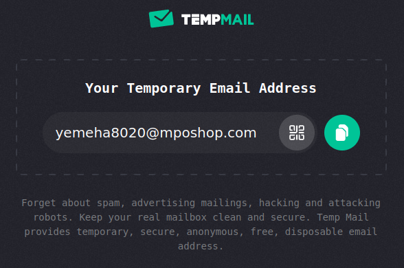

This guide will demonstrate how to set up an X2E board as an environmental sensor, covering the process from flashing the firmware to configuring a new Provision ID.


## Change the X2E firmware

If your X2E board is currently running different firmware, please follow the steps below to update the firmware for this tutorial.

1. Download the mobile APP tool (Nordic DFU) for firmware update.

   https://play.google.com/store/apps/details?id=no.nordicsemi.android.dfu&hl=en&gl=US

   https://apps.apple.com/tt/app/nrf-device-firmware-update/id1624454660  (require iOS 16)

2. Copy the firmware binary file `environmental_sensor_dfu_ism2400.zip` to you mobile phone. 
   (Important: Place the file in the download folder, otherwise it may not be recognized correctly)

3. Start the DFU App and select the firmware binary file.

   

4. Tap the Device's "Select" button to start scanning for BLE devices.

5. Press and hold the "USER" button of X2E board for 5s to start the DFU routine. The LED will become fast blinking when DFU started and it will shows up on the App.

   

6. Select the X2E board on the list as the target device.

   

7. Tap "Start" button to start the firmware upgrade.

   

8. Wait until the upgrade process complete.


## Purchase a Provision ID (PID)

Find a temporary email service provider to get the email address for receiving the PID. As the email address will be on the moonchain, using a temporary email address can prevent your private email address showing to public on the chain.




Check the device profile (from MEP803) that we will be using. It needs to match the firmware of the X2E board. We will be using an existing ISM2400 profile, with the index set to 2.

```
cast call 0xBFc77Ee5959699eC4171891b625D6EccdC9e00cD "deviceProfileList(uint256) (uint256,string,address,string,bool,uint256)" 2 --rpc-url https://geneva-rpc.moonchain.com --private-key 318dee0c207c20f4767e342a52e876b816379334a53277773c783b0e9348d368
```

The response will be similar to the following.

```
2
X2E Ref Sensor - ISM2400
0xD9892d06C864a41A38915dDd48DF11A0DBfdCf89
https://api.github.com/repos/MatchX-GmbH/iso-device-profile/contents/matchx/x2e_ref_sensor_ism2400.json
true
1000000000000000000
```


Check the unit price of a PID from MEP802.

```
cast call 0x28479D68cD3ef5661BDB7505EFD1712D5D0951F6 "pidUnitPrice() (uint256)" --rpc-url https://geneva-rpc.moonchain.com --private-key 318dee0c207c20f4767e342a52e876b816379334a53277773c783b0e9348d368
```

The response will be `123450000000000000000` wei, means 123.45 MXC.


Please replace the email address with your own and send the following command to purchase one PID via MEP802.

```
cast send 0x28479D68cD3ef5661BDB7505EFD1712D5D0951F6 "producePid(string,uint256,uint256)" "yemeha8020@mposhop.com" 1 3 --rpc-url https://geneva-rpc.moonchain.com --private-key 318dee0c207c20f4767e342a52e876b816379334a53277773c783b0e9348d368 --value 123450000000000000000
```

Wait for few minutes after the transaction done, you will receive a email and attached with the PID csv file.


Please read the PID `K2ILSDXUOO3O4EEIWZDDW6SL` from the attached file and use it to set up the X2E board. You will also need the pidZkevmHash (5th column) when interacting with Moonchain.


## Setup the X2E Board

Connect the X2E board to your computer using a USB Type-C cable. Next, launch a serial terminal program like `minicom` on Linux or `PuTTY` on Windows, and establish a connection with the X2E board. Use the serial settings `115200 8N1`.

```
minicom -b 115200 -8  -D /dev/ttyACM0 -o
```

Then send a "AT" command to test the connection. If the connection is correct, the X2E will reply a "OK".


Send the following command at the serial terminal program to change the PID of the X2E board. *Replace the PID to the one got from previous steps.* You will get a OK if success.

```
AT+CQRCODE={"PID":"K2ILSDXUOO3O4EEIWZDDW6SL","B":"MatchX","M":"X2E","V":"1.3"}
```

Clear all data and reboot.

```
AT+IREBOOT=8
```


Wait for a while, the X2E board will finish the provisioning process with the new PID. Then it will start to join the network and sending data. After Joined, the status LED will lit steady and the Control pin (IO14) will goes high. If you are using the suggest connection, the target LED will lit.

If this doesn't happen after 6 minutes, please check the status of your NEO miner and make sure it is running.


After that, your X2E board is sending data to ChirpVM and ready to mine ISO sensor token.